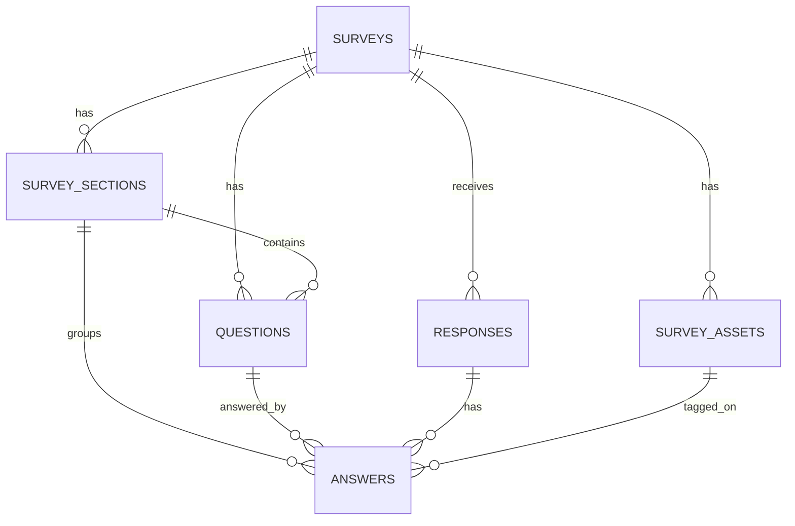

# Taglow Survey Participant TDD

## 1. 참여자 TDD 요약

참여자 페이지는 다음 흐름을 구현한다.

```text
공개 URL/QR 접속
→ 설문 상태 확인
→ Google 로그인
→ @handong.ac.kr 도메인 검증
→ 설문 안내 화면
→ 섹션별 질문 응답
→ 프론트엔드 캐시 임시 저장
→ 이미지/도면 태깅
→ 제출 전 검토
→ 최종 제출
→ responses + answers 저장
→ 제출 완료 화면
```

현재 서버가 없으므로 Supabase를 직접 사용한다. 하지만 참여자 페이지도 API Boundary를 적용해 서버 도입 후 Gateway만 교체할 수 있도록 설계한다.

```text
View
  → Query / Mutation Hook
  → ParticipantApiController
  → ParticipantPayloadMapper
  → ParticipantApiGateway
  → Supabase Database / Auth / Storage

서버 구축 후:
View
  → Query / Mutation Hook
  → ParticipantApiController
  → ParticipantPayloadMapper
  → HttpParticipantApiGateway
  → 자체 API 서버
  → Supabase
```

---

## 2. 공통 기술 스택

| 영역 | 선택 기술 | 적용 방식 |
| --- | --- | --- |
| Frontend | React + TypeScript | 참여자 SPA 구현 |
| Routing | React Router | 공개 설문 URL 라우팅 |
| Server State | TanStack Query | 공개 설문 데이터 조회, 제출 mutation 관리 |
| Client/UI State | Zustand | 현재 섹션, 진행률, locale, preview/draft restore 상태 관리 |
| Form State | React Hook Form | 섹션별 질문 입력값 관리 |
| Validation | Zod | 질문 유형별 값 검증, 제출 payload 검증 |
| Draft Cache | localStorage 우선, 필요 시 IndexedDB | 서버 부담 없는 프론트엔드 임시 저장 |
| Backend | Supabase | 서버 구축 전 데이터/API 백엔드 |
| Auth | Supabase Auth | Google 로그인, 세션 관리 |
| Storage | Supabase Storage | 이미지 태깅용 이미지 조회 |
| Database | Supabase Postgres | responses, answers 저장 |
| Test | Vitest + React Testing Library | 단위/컴포넌트 테스트 |
| E2E | Playwright | 로그인, 응답, 임시 저장, 제출 흐름 검증 |

---

## 3. 상태관리 선택

참여자 페이지는 서버 데이터보다 “응답 중인 폼 상태”가 중요하다. 따라서 다음처럼 역할을 나눈다.

```text
공개 설문 구조 데이터
→ TanStack Query

참여자 진행 상태
→ Zustand

질문 입력값
→ React Hook Form

임시 저장 draft
→ localStorage / IndexedDB
```

## 3.1 TanStack Query 사용 범위

- 공개 설문 데이터 조회
- 설문 상태 확인
- 이미지 asset metadata 조회
- 제출 mutation
- 중복 제출 여부 조회

## 3.2 Zustand 사용 범위

- 현재 선택 locale
- 현재 section index
- 완료된 section id 목록
- draft 복구 여부
- 제출 전 검토 화면 진입 여부
- 이미지 태깅 UI 상태

## 3.3 React Hook Form 사용 범위

- 질문 입력값 관리
- 섹션 단위 validation
- 제출 전 전체 validation
- dirty/touched 상태 추적

## 3.4 Draft Cache 사용 범위

- 서버에는 최종 제출 전까지 저장하지 않는다.
- draft는 `survey_id + participant_user_id` 기준으로 구분한다.
- 제출 성공 시 draft를 삭제한다.
- 브라우저/기기 변경 간 draft 동기화는 지원하지 않는다.

---

## 4. 프로젝트 구조

Participant 프로젝트도 Generalized Project Structure Guide의 원칙을 따른다.

```text
src/
├── app/
│   ├── App.tsx
│   ├── router.tsx
│   ├── providers.tsx
│   ├── queryClient.ts
│   └── routeGuards.tsx
│
├── api/
│   └── participant/
│       ├── model/
│       │   ├── publicSurvey.ts
│       │   ├── section.ts
│       │   ├── question.ts
│       │   ├── answerDraft.ts
│       │   ├── submission.ts
│       │   └── commands.ts
│       │
│       ├── service/
│       │   ├── gateway/
│       │   │   ├── participantApiGateway.ts
│       │   │   ├── supabaseParticipantApiGateway.ts
│       │   │   ├── httpParticipantApiGateway.ts
│       │   │   └── apiErrors.ts
│       │   │
│       │   ├── mapper/
│       │   │   └── participantPayloadMapper.ts
│       │   │
│       │   ├── draft/
│       │   │   ├── draftStorage.ts
│       │   │   ├── localStorageDraftStorage.ts
│       │   │   └── indexedDbDraftStorage.ts
│       │   │
│       │   └── validation/
│       │       ├── answerSchema.ts
│       │       ├── submissionSchema.ts
│       │       └── branchEvaluator.ts
│       │
│       ├── controller/
│       │   ├── participantApiController.ts
│       │   ├── gatewayBackedParticipantApiController.ts
│       │   └── participantApiControllerProvider.tsx
│       │
│       ├── query/
│       │   ├── queryKeys.ts
│       │   ├── usePublicSurveyQuery.ts
│       │   ├── useSubmissionMutation.ts
│       │   └── useDuplicateSubmissionQuery.ts
│       │
│       └── runtime/
│           ├── createParticipantApiRuntime.ts
│           └── participantApiRuntime.tsx
│
├── store/
│   ├── participantProgressStore.ts
│   ├── participantLocaleStore.ts
│   ├── participantDraftStore.ts
│   ├── imageTaggingStore.ts
│   └── uiStore.ts
│
├── components/
│   ├── Button.tsx
│   ├── Select.tsx
│   ├── ProgressBar.tsx
│   ├── StepHeader.tsx
│   ├── Message.tsx
│   └── css/
│
├── utils/
│   ├── envConfig.ts
│   ├── authDomain.ts
│   ├── i18nText.ts
│   ├── imageRatio.ts
│   ├── answerNormalizer.ts
│   ├── draftKey.ts
│   └── dateTime.ts
│
├── view/
│   └── participant/
│       ├── auth/
│       │   ├── ParticipantLoginPage.tsx
│       │   └── components/
│       │
│       ├── survey/
│       │   ├── SurveyEntryPage.tsx
│       │   ├── SurveyIntroPage.tsx
│       │   ├── SurveySectionPage.tsx
│       │   ├── SurveyReviewPage.tsx
│       │   ├── SurveyCompletePage.tsx
│       │   └── components/
│       │       ├── SectionNavigator.tsx
│       │       ├── QuestionRenderer.tsx
│       │       ├── ScaleQuestion.tsx
│       │       ├── SingleChoiceQuestion.tsx
│       │       ├── MultiSelectQuestion.tsx
│       │       ├── RankingQuestion.tsx
│       │       ├── TextQuestion.tsx
│       │       ├── ImageTagQuestion.tsx
│       │       ├── LowScoreFollowUp.tsx
│       │       ├── AttentionCheckQuestion.tsx
│       │       └── DraftRestoreBanner.tsx
│       │
│       └── system/
│           ├── SurveyNotFoundPage.tsx
│           ├── SurveyClosedPage.tsx
│           └── AccessDeniedPage.tsx
│
└── test/
    ├── setup.ts
    ├── renderWithProviders.tsx
    ├── fakeParticipantApiController.ts
    └── fixtures/
```

---

## 5. 라우팅 설계

```text
/survey/:publicSlug
/survey/:publicSlug/login
/survey/:publicSlug/intro
/survey/:publicSlug/sections/:sectionKey
/survey/:publicSlug/review
/survey/:publicSlug/complete
/survey/:publicSlug/closed
/survey/:publicSlug/access-denied
```

### 5.1 라우트 가드

| Guard | 적용 라우트 | 조건 |
| --- | --- | --- |
| `RequirePublicSurvey` | `/survey/:publicSlug/**` | public_slug가 존재하고 status가 published |
| `RequireParticipantAuth` | intro 이후 | Supabase session 존재 |
| `RequireHandongEmail` | intro 이후 | email이 `@handong.ac.kr`로 끝남 |
| `PreventDuplicateSubmission` | section/review | 이미 제출한 경우 complete 또는 안내 화면으로 이동 |

---

## 6. 데이터 흐름

## 6.1 공개 설문 조회

```text
SurveyEntryPage mount
→ usePublicSurveyQuery(publicSlug)
→ ParticipantApiController.getPublicSurvey(publicSlug)
→ ParticipantApiGateway.fetchPublicSurvey(publicSlug)
→ ParticipantPayloadMapper.toPublicSurvey(raw)
→ View renders intro/sections/questions
```

## 6.2 응답 입력

```text
QuestionRenderer
→ question_type별 입력 component
→ React Hook Form 값 업데이트
→ section validation
→ draft autosave
```

## 6.3 최종 제출

```text
SurveyReviewPage submit
→ 전체 validation
→ ParticipantApiController.submitSurvey(command)
→ ParticipantPayloadMapper.toSubmitPayload(command)
→ ParticipantApiGateway.submitSurvey(payload)
→ responses row 생성
→ answers rows bulk insert
→ draft 삭제
→ SurveyCompletePage 이동
```

---

## 7. Database 사용 범위

Participant 페이지는 같은 6개 테이블을 사용한다.

```text
surveys           read only
survey_sections   read only
questions         read only
survey_assets     read only
responses         insert only for own submission
answers           insert only for own submission
```

## 7.1 Participant 관점 ERD



## 7.2 응답 저장 원칙

- 최종 제출 전에는 서버에 저장하지 않는다.
- 최종 제출 시 `responses` 1개 row를 만든다.
- 각 질문 응답은 `answers` 여러 row로 저장한다.
- 기본 정보는 `responses` 컬럼으로 저장한다.
- 질문별 실제 응답은 `answers`에 저장한다.
- 복잡한 선택지, 순위형, 후속 질문 값은 `answers.value_json`에 저장한다.
- 이미지 태깅은 `answers.x_ratio`, `answers.y_ratio`, `answers.tag_type`, `answers.text_value`를 사용한다.

---

## 8. Participant Domain Model

```ts
export type Locale = 'ko' | 'en';

export type PublicSurvey = Readonly<{
  id: string;
  publicSlug: string;
  title: string;
  description?: string;
  status: 'published' | 'closed';
  defaultLocale: Locale;
  supportedLocales: Locale[];
  sections: PublicSurveySection[];
  questions: PublicQuestion[];
  assets: PublicSurveyAsset[];
}>;

export type PublicSurveySection = Readonly<{
  id: string;
  sectionKey: string;
  title: string;
  description?: string;
  orderIndex: number;
  sectionType: string;
  settings: SectionSettings;
}>;

export type PublicQuestion = Readonly<{
  id: string;
  sectionId: string;
  questionKey: string;
  questionType: QuestionType;
  title: string;
  description?: string;
  orderIndex: number;
  isRequired: boolean;
  metricType: MetricType;
  topicKey?: string;
  spaceKey?: string;
  config: PublicQuestionConfig;
  validation: PublicQuestionValidation;
}>;

export type AnswerDraft = Readonly<{
  questionId: string;
  answerType: string;
  metricType?: string;
  scoreValue?: number;
  textValue?: string;
  choiceValue?: string;
  valueJson?: Record<string, unknown>;
  tagPoints?: ImageTagPoint[];
}>;

export type ImageTagPoint = Readonly<{
  assetId: string;
  xRatio: number;
  yRatio: number;
  tagType: string;
  severity?: number;
  textValue: string;
}>;
```

---

## 9. ParticipantApiGateway 계약

```ts
export interface ParticipantApiGateway {
  fetchPublicSurvey(publicSlug: string): Promise<RawPublicSurvey>;
  fetchDuplicateSubmission(args: RawDuplicateSubmissionArgs): Promise<RawDuplicateSubmissionResult>;
  submitSurvey(payload: RawSubmitSurveyPayload): Promise<RawSubmissionResult>;
}
```

## 9.1 SupabaseParticipantApiGateway

- 공개 설문 조회는 `surveys`, `survey_sections`, `questions`, `survey_assets`를 조합한다.
- status가 `published`인 설문만 참여자에게 반환한다.
- 제출 시 `responses` insert 후 `answers` bulk insert를 수행한다.
- 가능하면 RPC `submit_survey_response(payload jsonb)`를 사용해 transaction으로 처리한다.
- RPC가 준비되지 않은 초기 단계에서는 Gateway에서 insert 순서를 관리한다.

## 9.2 HttpParticipantApiGateway 전환

서버 구축 후에는 다음 endpoint를 호출한다.

```text
GET  /api/surveys/:publicSlug/public
GET  /api/surveys/:surveyId/submission-status
POST /api/surveys/:surveyId/responses
```

Gateway만 교체하고 View/Query/Controller는 유지한다.

---

## 10. ParticipantApiController 계약

```ts
export interface ParticipantApiController {
  getPublicSurvey(publicSlug: string, locale: Locale): Promise<PublicSurvey>;
  checkDuplicateSubmission(command: CheckDuplicateSubmissionCommand): Promise<DuplicateSubmissionResult>;
  submitSurvey(command: SubmitSurveyCommand): Promise<SubmissionResult>;
}
```

## 10.1 SubmitSurveyCommand

```ts
export type SubmitSurveyCommand = Readonly<{
  surveyId: string;
  participantUserId: string;
  participantEmail: string;
  locale: Locale;
  profile: RespondentProfile;
  answers: AnswerDraft[];
  rawPayload: Record<string, unknown>;
  startedAt?: string;
}>;
```

---

## 11. Query Hook 설계

```ts
export const participantQueryKeys = {
  publicSurvey: (publicSlug: string, locale: Locale) =>
    ['participant', 'publicSurvey', publicSlug, locale] as const,
  duplicateSubmission: (surveyId: string, userId: string) =>
    ['participant', 'duplicateSubmission', surveyId, userId] as const,
};
```

| Hook | 기능 |
| --- | --- |
| `usePublicSurveyQuery(publicSlug, locale)` | 공개 설문 구조 조회 |
| `useDuplicateSubmissionQuery(surveyId, userId)` | 중복 제출 여부 확인 |
| `useSubmitSurveyMutation()` | 최종 제출 |

---

## 12. 임시 저장 설계

## 12.1 Draft Key

```ts
export function buildDraftKey(args: {
  surveyId: string;
  participantUserId: string;
}): string {
  return `taglow-survey-draft:${args.surveyId}:${args.participantUserId}`;
}
```

## 12.2 Draft Storage Interface

```ts
export interface DraftStorage {
  loadDraft(key: string): Promise<SurveyDraft | null>;
  saveDraft(key: string, draft: SurveyDraft): Promise<void>;
  removeDraft(key: string): Promise<void>;
}
```

## 12.3 SurveyDraft

```ts
export type SurveyDraft = Readonly<{
  surveyId: string;
  participantUserId: string;
  locale: Locale;
  currentSectionId?: string;
  answersByQuestionId: Record<string, AnswerDraft>;
  updatedAt: string;
  schemaVersion: number;
}>;
```

## 12.4 Autosave 정책

- 질문 값 변경 후 debounce 500ms로 저장한다.
- 섹션 이동 시 즉시 저장한다.
- 제출 성공 시 draft를 삭제한다.
- 설문 구조 version이 바뀌면 draft 복구 전 사용자에게 안내한다.
- localStorage quota 오류 발생 시 IndexedDB fallback 또는 임시 저장 실패 안내를 제공한다.

---

## 13. 질문 렌더링 설계

## 13.1 QuestionRenderer

```tsx
export function QuestionRenderer(props: {
  question: PublicQuestion;
  assetMap: Map<string, PublicSurveyAsset>;
}) {
  switch (props.question.questionType) {
    case 'profile':
      return <ProfileQuestion question={props.question} />;
    case 'experience':
      return <ExperienceQuestion question={props.question} />;
    case 'scale':
      return <ScaleQuestion question={props.question} />;
    case 'single_choice':
      return <SingleChoiceQuestion question={props.question} />;
    case 'multi_select':
      return <MultiSelectQuestion question={props.question} />;
    case 'ranking':
      return <RankingQuestion question={props.question} />;
    case 'text':
      return <TextQuestion question={props.question} />;
    case 'image_tag':
      return <ImageTagQuestion question={props.question} assetMap={props.assetMap} />;
    case 'attention_check':
      return <AttentionCheckQuestion question={props.question} />;
  }
}
```

## 13.2 조건부 분기

질문 config에 branch rule이 있을 경우 `branchEvaluator`가 현재 답변 draft를 기준으로 표시 여부를 계산한다.

```ts
export function shouldShowQuestion(args: {
  question: PublicQuestion;
  answersByQuestionId: Record<string, AnswerDraft>;
}): boolean;
```

예시:

```json
{
  "show_if": {
    "question_key": "laundry_satisfaction",
    "operator": "lte",
    "value": 2
  }
}
```

## 13.3 낮은 만족도 후속 질문

- scale 질문의 `scoreValue <= threshold`이면 후속 질문을 노출한다.
- 후속 질문 값은 동일 answer의 `value_json.low_score_reason`에 저장하거나, 별도 followup question으로 저장한다.
- MVP에서는 동일 answer의 `value_json` 저장을 우선한다.

---

## 14. 이미지 태깅 설계

## 14.1 좌표 계산

이미지 DOM 좌표를 0~1 비율로 변환한다.

```ts
export function toImageRatio(args: {
  clientX: number;
  clientY: number;
  imageRect: DOMRect;
}): { xRatio: number; yRatio: number } {
  return {
    xRatio: clamp((args.clientX - args.imageRect.left) / args.imageRect.width, 0, 1),
    yRatio: clamp((args.clientY - args.imageRect.top) / args.imageRect.height, 0, 1),
  };
}
```

## 14.2 ImageTagQuestion 동작

```text
이미지 표시
→ 참여자 위치 터치/클릭
→ pin 표시
→ tag_type 선택
→ severity 선택
→ 짧은 설명 입력
→ 저장
→ 최대 태그 수 도달 시 추가 방지
```

## 14.3 저장 shape

```ts
export type ImageTagAnswerValue = {
  points: Array<{
    assetId: string;
    xRatio: number;
    yRatio: number;
    tagType: string;
    severity?: number;
    textValue: string;
  }>;
};
```

최종 제출 시 각 point는 `answers` row 하나로 펼쳐 저장한다.

```text
answer_type = image_tag
asset_id = point.assetId
x_ratio = point.xRatio
y_ratio = point.yRatio
tag_type = point.tagType
severity = point.severity
text_value = point.textValue
```

---

## 15. 제출 Payload 설계

## 15.1 SubmitSurveyPayload

```json
{
  "survey_id": "uuid",
  "participant_user_id": "uuid",
  "participant_email": "student@handong.ac.kr",
  "locale": "ko",
  "profile": {
    "gender": "남",
    "semester_group": "3-4",
    "department": "전산전자공학부",
    "rc": "손양원",
    "dormitory": "로뎀관",
    "room_type": "4인실",
    "dorm_experience": "두 번 이상"
  },
  "answers": [
    {
      "question_id": "uuid",
      "section_id": "uuid",
      "answer_type": "scale",
      "metric_type": "satisfaction",
      "topic_key": "laundry",
      "space_key": "laundry_room",
      "score_value": 2,
      "value_json": {
        "low_score_reason": ["고장이 잦음", "청결 문제"]
      }
    }
  ],
  "raw_payload": {}
}
```

## 15.2 Mapper 저장 규칙

| 질문 유형 | answers 저장 방식 |
| --- | --- |
| profile | responses 컬럼 + profile_json |
| experience | answer_type=experience, value_json.experience_status |
| scale | answer_type=scale, score_value, metric_type |
| single_choice | answer_type=single_choice, choice_value |
| multi_select | answer_type=multi_select, value_json.selected_values |
| ranking | answer_type=ranking, value_json.ranked_values |
| text | answer_type=text, text_value, value_json.topic/location |
| image_tag | point별 answers row, x_ratio/y_ratio/tag_type/text_value |
| attention_check | answer_type=attention_check, choice_value 또는 score_value |

---

## 16. Validation 설계

## 16.1 제출 전 검증

- 모든 필수 profile 값 존재
- 필수 질문 답변 존재
- scale 값은 1~5 사이
- multi_select는 min/max 선택 수 준수
- ranking은 중복 선택 없음
- text 필수 질문은 공백 불가
- image_tag는 max_tags 이하
- image_tag의 각 point는 x_ratio/y_ratio 0~1 사이
- attention_check expected value 일치
- `@handong.ac.kr` 이메일 검증 완료

## 16.2 Zod 예시

```ts
const imageTagPointSchema = z.object({
  assetId: z.string().uuid(),
  xRatio: z.number().min(0).max(1),
  yRatio: z.number().min(0).max(1),
  tagType: z.string().min(1),
  severity: z.number().int().min(1).max(5).optional(),
  textValue: z.string().min(1),
});
```

---

## 17. Auth / 접근 제어

## 17.1 로그인 흐름

```text
ParticipantLoginPage
→ Supabase Auth Google OAuth
→ session.email 확인
→ @handong.ac.kr 검증
→ 중복 제출 여부 확인
→ SurveyIntroPage 이동
```

## 17.2 RLS 방향

```sql
create policy "published surveys are readable by handong users"
on surveys
for select
to authenticated
using (
  status = 'published'
  and (auth.jwt() ->> 'email') like '%@handong.ac.kr'
);

create policy "participant can insert own response"
on responses
for insert
to authenticated
with check (
  participant_user_id = auth.uid()
  and participant_email = (auth.jwt() ->> 'email')
  and participant_email like '%@handong.ac.kr'
);

create policy "participant can insert answers for own response"
on answers
for insert
to authenticated
with check (
  exists (
    select 1 from responses r
    where r.id = answers.response_id
      and r.participant_user_id = auth.uid()
  )
);
```

중복 제출 제한은 partial unique index로 보강할 수 있다.

```sql
create unique index uniq_submitted_response_per_user
on responses (survey_id, participant_user_id)
where status = 'submitted';
```

---

## 18. 에러 처리

| 에러 | 처리 |
| --- | --- |
| 설문 없음 | SurveyNotFoundPage |
| 설문 종료 | SurveyClosedPage |
| 비로그인 | LoginPage |
| handong 계정 아님 | AccessDeniedPage |
| 중복 제출 | Complete 또는 Duplicate 안내 |
| draft parse 실패 | draft 무시 후 새 응답 시작 안내 |
| 제출 실패 | 재시도 버튼, draft 유지 |
| 이미지 로딩 실패 | 대체 안내, 해당 태깅 질문 skip 불가 시 오류 표시 |
| Storage quota 오류 | 임시 저장 실패 안내, 수동 제출 유도 |

---

## 19. 테스트 전략

## 19.1 계층별 테스트

| 계층 | 테스트 대상 |
| --- | --- |
| Mapper | raw survey row → PublicSurvey 변환, locale fallback, submit payload 변환 |
| Gateway | public survey fetch, response insert, answers bulk insert, error normalization |
| Controller | getPublicSurvey, checkDuplicateSubmission, submitSurvey 흐름 |
| Draft Storage | save/load/remove, schemaVersion mismatch, corrupted draft 처리 |
| Branch Evaluator | 조건부 질문 표시 여부 |
| Image Ratio | 좌표 변환, 0~1 clamp |
| Query | public survey query, submit mutation success/failure |
| Component | 각 질문 유형 렌더링과 validation |
| E2E | 로그인 → draft 저장 → 복구 → 제출 완료 |

## 19.2 주요 테스트 케이스

### Auth

| ID | Given | When | Then |
| --- | --- | --- | --- |
| P-AUTH-01 | 비로그인 사용자 | 설문 URL 접속 | 로그인 CTA 표시 |
| P-AUTH-02 | gmail.com 계정 | 로그인 완료 | 접근 불가 안내 |
| P-AUTH-03 | handong 계정 | 로그인 완료 | 설문 안내 표시 |
| P-AUTH-04 | 이미 제출한 사용자 | 설문 진입 | 중복 제출 안내 |

### Survey Rendering

| ID | Given | When | Then |
| --- | --- | --- | --- |
| P-RENDER-01 | published survey | URL 접속 | 섹션 목록/첫 섹션 표시 |
| P-RENDER-02 | locale=en | 설문 조회 | 영어 title 표시, 누락 시 ko fallback |
| P-RENDER-03 | image_tag 질문 | 섹션 진입 | 이미지와 태깅 안내 표시 |
| P-RENDER-04 | attention_check 질문 | 렌더링 | expected option 표시 |

### Draft

| ID | Given | When | Then |
| --- | --- | --- | --- |
| P-DRAFT-01 | 질문 입력 | 500ms 경과 | localStorage에 draft 저장 |
| P-DRAFT-02 | draft 존재 | 재접속 | 복구 배너 표시 |
| P-DRAFT-03 | 제출 성공 | complete 이동 | draft 삭제 |
| P-DRAFT-04 | corrupted draft | 로드 | 안전하게 무시 |

### Question Validation

| ID | Given | When | Then |
| --- | --- | --- | --- |
| P-VAL-01 | 필수 scale 미응답 | 다음 클릭 | 오류 표시 |
| P-VAL-02 | 낮은 만족도 | 다음 클릭 | 후속 이유 요구 |
| P-VAL-03 | multi_select max 초과 | 선택 | 추가 선택 방지 |
| P-VAL-04 | ranking 중복 선택 | 저장 | 오류 표시 |
| P-VAL-05 | image tag 좌표 | 저장 | 0~1 비율로 저장 |

### Submission

| ID | Given | When | Then |
| --- | --- | --- | --- |
| P-SUB-01 | 유효한 응답 | 제출 | responses 1개, answers N개 생성 |
| P-SUB-02 | 네트워크 실패 | 제출 | draft 유지, 재시도 표시 |
| P-SUB-03 | 중복 제출 | 제출 | 중복 오류 표시 |
| P-SUB-04 | image tag 2개 | 제출 | answers에 image_tag row 2개 생성 |

---

## 20. 개발 Phase

## Phase 1. Foundation

- React + TypeScript 프로젝트 구성
- Supabase Auth 설정
- Participant API Runtime 구성
- Query Client 구성
- Zustand store 구성
- public survey route 구성

## Phase 2. Survey Renderer

- 공개 설문 조회
- 섹션 진행 UI
- QuestionRenderer
- scale/single/multi/ranking/text 질문 구현
- locale fallback 구현

## Phase 3. Draft / Validation

- React Hook Form 구조화
- Zod validation
- localStorage draft autosave
- draft restore banner
- branch evaluator
- low score followup

## Phase 4. Image Tagging

- image asset 렌더링
- 좌표 계산
- tag type/severity/text 입력
- pin 수정/삭제
- max tag 제한

## Phase 5. Submission

- submit payload mapper
- Supabase insert/RPC
- duplicate submission check
- complete page
- error/retry 처리

## Phase 6. E2E Hardening

- Playwright 시나리오
- 모바일 viewport 테스트
- 다국어 테스트
- 네트워크 실패 테스트

---

## 21. 완료 기준

참여자 TDD 기준 구현 완료는 다음 조건을 만족해야 한다.

1. View에서 Supabase SDK를 직접 import하지 않는다.
2. Query Hook은 ParticipantApiController만 호출한다.
3. Gateway 교체만으로 Supabase 직접 접근에서 자체 서버 API 접근으로 전환할 수 있다.
4. 공개 URL로 설문을 조회할 수 있다.
5. Google 로그인과 `@handong.ac.kr` 검증이 동작한다.
6. 설문은 섹션 단위로 표시된다.
7. 질문 유형별 입력과 validation이 동작한다.
8. draft가 프론트엔드 캐시에 저장/복구된다.
9. 이미지 태깅 좌표가 x_ratio/y_ratio로 저장된다.
10. 최종 제출 시 responses와 answers가 올바르게 생성된다.
11. 제출 실패 시 draft가 유지된다.
12. 모든 핵심 계층에 테스트가 존재한다.

---

## 22. 참고 문서

- Supabase Data REST API Docs
- Supabase Row Level Security Docs
- Supabase Storage Access Control Docs
- TanStack Query React Docs
- Generalized API Boundary Guide
- Generalized Project Structure Guide
